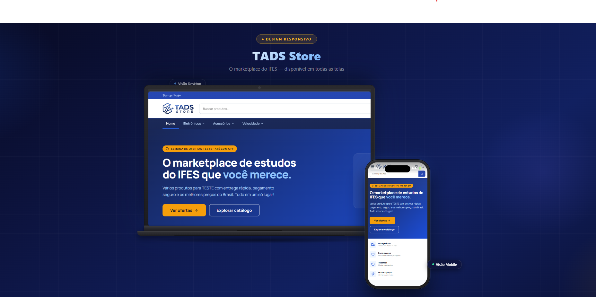

<h1 align="center">TADS Store - Quintiliano Nery</h1>

<p align="center">
  

</p>

Marketplace de tecnologia (pt-BR) construído em **React 18 + Vite**, fiel ao
**TADS Store Design System** (trust-blue + âmbar, fonte Manrope).

Nasceu como protótipo offline e evoluiu para uma versão real, com
**autenticação e dados no Supabase** (auth JWT + Postgres com RLS), **catálogo**
da **API DummyJSON** e **checkout com Mercado Pago**. Carrinho, favoritos,
endereços, avaliações e pedidos são persistidos por usuário.

## Funcionalidades

- **Conta e sessão**: cadastro, login, logout e sessão persistente (JWT do
  Supabase) — o usuário permanece logado após reload.
- **Perfil**: dados do usuário e troca de senha na própria conta.
- **Favoritos** vinculados ao usuário (sincronizados no Supabase).
- **Carrinho** vinculado ao usuário, com controle de estoque (opções de compra
  desabilitadas quando indisponível).
- **Avaliações** de produtos (nota + comentário), uma por usuário/produto.
- **Checkout em etapas**: entrega (com agenda de endereços), pagamento e
  confirmação (resumo antes de finalizar).
- **Pedidos**: histórico e detalhes por usuário.
- **Rotas protegidas**: apenas usuários autenticados acessam seus próprios dados.
- **Validação e máscaras** de formulário (CPF/CNPJ, telefone, CEP, e-mail).
- **Layout responsivo**: adaptado para celular e tablet (menu em gaveta,
  colunas que empilham, grades fluidas).
- **Página 404**: rota coringa (`path="*"`) com mensagem amigável e atalhos de
  volta à loja e para as categorias ([`src/screens/NaoEncontrado.jsx`](src/screens/NaoEncontrado.jsx)).

> ⚠️ **Estoque**: a DummyJSON não persiste alterações de estoque (aceita `PUT` e
> finge sucesso). A baixa real é **derivada dos pedidos pagos** no Supabase: o
> estoque exibido = base da DummyJSON − soma do que o usuário comprou. Ver
> `getStockConsumption` / `reloadStock` em
> [`src/context/StoreContext.jsx`](src/context/StoreContext.jsx).

## Stack

- **React 18 + Vite** ([`vite.config.js`](vite.config.js)) + `react-router-dom`.
- **Supabase** (`@supabase/supabase-js`) — auth + Postgres + RLS.
- **DummyJSON** — catálogo de produtos.
- **Vitest** — testes unitários (node) + testes de componente (Storybook/browser).
- Estilo: CSS vars (design tokens), sem framework de UI.

## Requisitos

- Node.js 18+
- npm
- Uma conta/projeto no [Supabase](https://supabase.com) (auth + banco)

## Configuração (variáveis de ambiente)

Copie o exemplo e preencha com os seus valores:

```bash
cp .env.example .env
```

Para avaliação de estudos, o arquivo `.env` será enviado na atividade do IFES.
As variáveis são:

| Variável | Obrigatória | Descrição |
| --- | --- | --- |
| `VITE_SUPABASE_URL` | ✅ | URL do projeto Supabase (Settings → API) |
| `VITE_SUPABASE_ANON_KEY` | ✅ | Chave anônima do Supabase |
| `VITE_MP_PUBLIC_KEY` | opcional | Chave pública do Mercado Pago |
| `VITE_API_BASE_URL` | opcional | Base da API de catálogo (default DummyJSON) |
| `MP_WEBHOOK_SECRET` | opcional | Segredo do webhook do Mercado Pago |
| `SUPABASE_SERVICE_ROLE_KEY` | opcional | Chave de serviço do Supabase (para funções serverless) |

> O cliente Supabase ([`src/services/supabase.js`](src/services/supabase.js))
> lança erro se as variáveis obrigatórias não estiverem definidas.

### Banco de dados (migrations)

As tabelas (`profiles`, `addresses`, `orders`, `order_items`, `favorites`,
`cart_items`, `reviews`) ficam em [`supabase/migrations/`](supabase/migrations/),
todas com **RLS** (cada usuário só acessa o próprio dado). Rode os arquivos
`.sql` manualmente no **SQL Editor** do Supabase, na ordem cronológica do nome —
ou aplique de uma vez o schema consolidado
[`supabase/migrations/schema_completo.sql`](supabase/migrations/schema_completo.sql).

## Como rodar

> Todos os comandos são executados a partir da **raiz do projeto** (`tads_store/`).

```bash
npm install        # instala as dependências
npm run dev        # app em http://localhost:5173
npm run build      # build de produção (pasta dist/)
npm run preview    # serve o build de produção
```

> 🔑 **Acesso de teste**: para entrar na loja, use uma conta já cadastrada:
>
> | Campo | Valor |
> | --- | --- |
> | E-mail | `test_user_1607170486577907987@testuser.com` |
> | Senha | `y6DsZcc89x` |
>
> Ao finalizar a compra, o pagamento abre o **Mercado Pago** — faça login lá com
> a **credencial de comprador de teste** (ver
> [Pagar em ambiente de teste](#pagar-em-ambiente-de-teste)).

### Rodando com o pagamento local (funções serverless)

O checkout chama funções em `api/` (ex.: `api/create-preference.js`), que o Vite
(`npm run dev`) **não** executa. Para testá-las localmente, rode o **`vercel dev`**
em paralelo, em **dois terminais**:

```bash
# Terminal 1 — funções /api na porta 3000 (lê o .env)
npm i -g vercel    # instala a CLI da Vercel (apenas na 1ª vez)
vercel link        # vincula a pasta ao projeto da Vercel (apenas na 1ª vez)
vercel dev         # sobe as funções em http://localhost:3000
```

```bash
# Terminal 2 — a aplicação (Vite)
npm run dev        # app em http://localhost:5173
```

Use a loja em **<http://localhost:5173>**: o [`vite.config.js`](vite.config.js)
faz proxy de `/api` para o `vercel dev` (3000). Sem o `vercel dev` rodando, o
botão "Pagar com Mercado Pago" falha (a rota `/api` não existe no Vite).

> A confirmação por **webhook** exige URL pública (https) — só funciona no deploy
> da Vercel, não em `localhost`. Detalhes em
> [`docs/progresso/007_mercadopago_vercel.md`](docs/progresso/007_mercadopago_vercel.md).

## Pagamento (Mercado Pago — Checkout Pro)

A preference é criada em função serverless (o Access Token nunca vai ao
front-end) e o pagamento é confirmado por webhook server-side.

### Pagar em ambiente de teste

Use **sempre credenciais de teste** (`APP_USR-`) disponíveis dentro do painel do
desenvolvedor do Mercado Pago, em Credenciais Teste. Realize o login com a conta
Mercado Pago usando a credencial de **comprador de teste** — nunca com a conta de
vendedor, senão o Mercado Pago recusa com *"uma das partes é de teste"*, e nem
com uma conta real.

**Conta de comprador de teste Acesso conta Mercado Pago:**

| Campo | Valor |
| --- | --- |
| Usuário (no lugar do e-mail) | `TESTUSER1607170486577907987` |
| Senha | `y6DsZcc89x` |

O comprador pode pagar com o **saldo em conta** ou com um **cartão de teste**:

| Cartão | Número | CVV | Validade |
| --- | --- | --- | --- |
| Mastercard | `5031 4332 1540 6351` | `123` | `11/30` |
| Visa | `4235 6477 2802 5682` | `123` | `11/30` |
| American Express | `3753 651535 56885` | `1234` | `11/30` |
| Elo (débito) | `5067 7667 8388 8311` | `123` | `11/30` |

Para **aprovar** o pagamento, preencha o **titular do cartão** com `APRO` e o
documento **CPF `12345678909`**. Ou use os cartões já cadastrados, para não ter a
compra de teste recusada.

## Scripts disponíveis

| Comando | O que faz |
| --- | --- |
| `npm run dev` | Sobe a aplicação (Vite) em <http://localhost:5173> |
| `npm run build` | Gera o build de produção em `dist/` |
| `npm run preview` | Serve localmente o build de produção |
| `npm run lint` | Roda o ESLint (`--max-warnings 0`) |
| `npm run storybook` | Sobe o Storybook em <http://localhost:6006> |
| `npm run build-storybook` | Gera o Storybook estático em `storybook-static/` |
| `npm test` | Roda todos os testes (unit em node + Storybook em browser) |
| `npm run test:watch` | Roda os testes em modo watch |

## Testes

São dois projetos de teste (config em [`vitest.config.js`](vitest.config.js)):

- **`unit`** — lógica pura e serviços, em [`tests/unit/`](tests/unit/). O Supabase
  é mockado via [`tests/helpers/supabaseMock.js`](tests/helpers/supabaseMock.js).
  Imports usam o alias `@/`.
- **`storybook`** — testes de componente do Design System, nas `*.stories.jsx`
  com função `play`, rodando em **Chromium real via Playwright**.

```bash
npm test                              # tudo (unit + storybook)
npx vitest run --project unit         # só os unitários (rápido, sem browser)
npx vitest --ui                       # dashboard no navegador
npx vitest --browser.headless=false   # abre o Chromium para ver as interações
```

> A primeira execução do projeto `storybook` pode ser mais lenta porque o
> Playwright inicializa o navegador.

## Estrutura

```text
src/
├── App.jsx            # rotas (protegidas via components/RotaProtegida)
├── components/
│   ├── ds/            # Design System: Button, Input, Badge, StarRating, Spinner, ProductCard (+ stories)
│   ├── AddressBook.jsx# agenda de endereços (CRUD), usada na conta e no checkout
│   ├── Header.jsx     # cabeçalho (topbar + busca + nav)
│   ├── Footer.jsx     # rodapé
│   └── Icon.jsx       # ícones Lucide inline
├── context/           # StoreContext — estado global (catálogo, carrinho, favoritos, sessão, nav)
├── screens/           # Home, Catalog, Detail, Cart, Checkout, Login, Account, Wishlist, Help, PedidoRecebido, NaoEncontrado (404)
├── hooks/             # useMediaQuery — responsividade para a UI em estilos inline
├── services/          # acesso a dados: supabase, auth, product, favorites, cart, address, order, review
├── lib/               # puros: format.js (fmtBRL, finalPrice), orderNumber.js + mercadopago.js
├── utils/             # validators.js, masks.js
└── styles/            # tokens (variables.css) + reset global (global.css)

api/                   # funções serverless da Vercel (create-preference, mp-webhook)
supabase/migrations/   # schema SQL (rodar manualmente no Supabase)
tests/                 # unit/ (node) + helpers/
```

## Diferencial

Além dos requisitos das etapas, o projeto inclui:

- **Autenticação real com JWT (Supabase)**
- **Checkout com Mercado Pago (Checkout Pro)**
- **Avaliações de produtos**
- **Storybook + testes**
- **Página 404 dedicada**
- **layout responsivo** (mobile/tablet).
